# 🧠 LifeMind: Yapay Zeka Destekli Yaşam Asistanı
<div align="center">
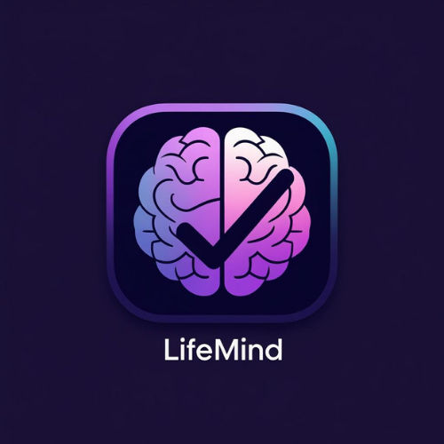
</div>
<br>
<div align="center">


</div>

> **"Hayatını planla, zihnini güçlendir, potansiyelini keşfet."**

**LifeMind**, klasik üretkenlik araçlarının sınırlarını aşan; **görev yönetimini**, **kişisel gelişimi** ve **yapay zeka desteğini** tek bir çatı altında birleştiren yeni nesil bir mobil ekosistemdir.

Sıradan bir "yapılacaklar listesi" uygulamasının ötesinde olan LifeMind, kullanıcının hem günlük işlerini organize etmesini sağlar hem de entegre **Öğrenme Merkezi (Learning Center)** sayesinde yeni bilgiler edinmesine yardımcı olur. Google'ın **Gemini AI** teknolojisinden güç alan bu asistan, size sadece görevlerinizi hatırlatmakla kalmaz; aynı zamanda öğrenmek istediğiniz terimleri tanımlar, quizlerde ipuçları verir ve motivasyonunuz düştüğünde sizi cesaretlendirir.

---

## 📑 İçindekiler

1. [🌟 Projenin Amacı ve Vizyonu](#-projenin-amacı-ve-vizyonu)
2. [✨ Temel Özellikler](#-temel-özellikler)
3. [📱 Ekran Görüntüleri ve Modüller](#-ekran-görüntüleri-ve-modüller)
4. [🛠 Teknik Altyapı (Tech Stack)](#-teknik-altyapı-tech-stack)
5. [📂 Proje Dosya Mimarisi](#-proje-dosya-mimarisi)
6. [💻 Kurulum ve Çalıştırma Rehberi](#-kurulum-ve-çalıştırma-rehberi)

---

## 🌟 Projenin Amacı ve Vizyonu

Günümüz dünyasında "planlama", "öğrenme" ve "motivasyon" genellikle farklı uygulamalara dağılmış durumdadır. LifeMind bu sorunu çözmek için geliştirilmiştir:

* **Bütünleşik Deneyim:** Takviminiz, görevleriniz ve ders notlarınız (Flashcards) artık aynı yerde.
* **AI Odaklı Verimlilik:** Manuel veri girişi yerine, yapay zeka desteğiyle saniyeler içinde içerik üretimi.
* **Oyunlaştırılmış İlerleme:** Sıkıcı görev takibi yerine; XP puanları, seviye sistemleri ve "Seri (Streak)" takibi ile alışkanlık kazandırma.
* **Kişiselleştirme:** Cinsiyetinize, kullanım alışkanlıklarınıza ve günün saatine göre şekillenen dinamik bir arayüz.

---

## ✨ Temel Özellikler

### 🤖 Yapay Zeka (AI) Entegrasyonu
* **Akıllı Tanımlar:** Öğrenme modülünde bir terim girdiğinizde, Google Gemini AI saniyeler içinde kısa ve öz bir tanım oluşturur.
* **Motivasyon Koçu:** Ana sayfada her gün (veya yenilendiğinde) sizi karşılayan, ruh halinize uygun AI tabanlı motivasyon mesajları.
* **Akıllı İpuçları:** Quiz sırasında zorlandığınızda, AI cevabı vermeden sizi doğru yola yönlendiren ipuçları sunar.

### 🎮 Oyunlaştırma (Gamification)
* **XP Sistemi:** Tamamlanan her görev ve doğru cevaplanan her quiz sorusu için XP (Puan) kazanın.
* **Seviye Atlama:** Topladığınız puanlarla seviye atlayın (Örn: Seviye 5 • 40/100 XP).
* **Seri (Streak) Takibi:** Her gün uygulama ile etkileşime girerek "Ateş Serisi"ni koruyun.
* **Başarı Kutlamaları:** Quiz bitiminde konfeti patlamalarıyla başarınızı kutlayın.

### 📅 Gelişmiş Planlama
* **Dinamik Görev Yönetimi:** Görevleri kategorize edin, tarihler atayın.
* **Akıllı Tarih Etiketleri:** "Bugün", "Yarın", "Gecikmiş" veya "2 Gün Sonra" gibi akıllı etiketler.
* **Takvim Görünümü:** Aylık takvim üzerinde hangi gün ne planınız var, nokta işaretleriyle görüntüleyin.

### 📚 Öğrenme Merkezi
* **Flashcard (Bilgi Kartı) Sistemi:** Kendi kelime/terim setlerinizi oluşturun.
* **Kategorilendirme:** Kartları renk kodlu kategorilere ayırın.
* **Sesli Okuma (TTS):** Kartlardaki İngilizce/Türkçe terimleri sesli olarak dinleyin (Expo Speech).
* **Otomatik Quiz Üretimi:** Eklediğiniz kartlardan otomatik olarak 4 şıklı testler oluşturulur.

---


## 📱 Ekran Görüntüleri ve Modüller

LifeMind deneyimi, **13 temel ekran** üzerinden kurgulanmıştır. Her ekran, kullanıcıyı motive etmek ve verimliliğini artırmak için özel olarak tasarlanmıştır.

### 🚀 Başlangıç ve Kimlik Doğrulama (Onboarding & Auth)

Kullanıcıyı karşılayan, uygulamanın değerini anlatan ve güvenli geçiş sağlayan ekranlar.

| **. Açılış (Splash)** | ** Tanıtım (Onboarding)** | ** Giriş (Login)** |
| --- | --- | --- |
|  | 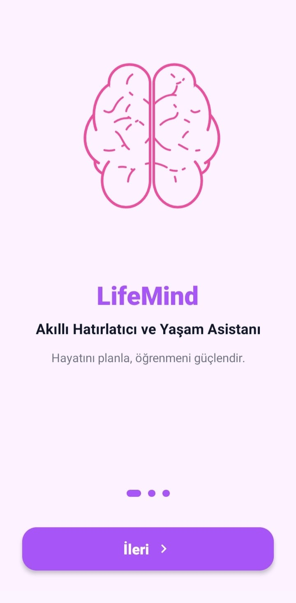 | 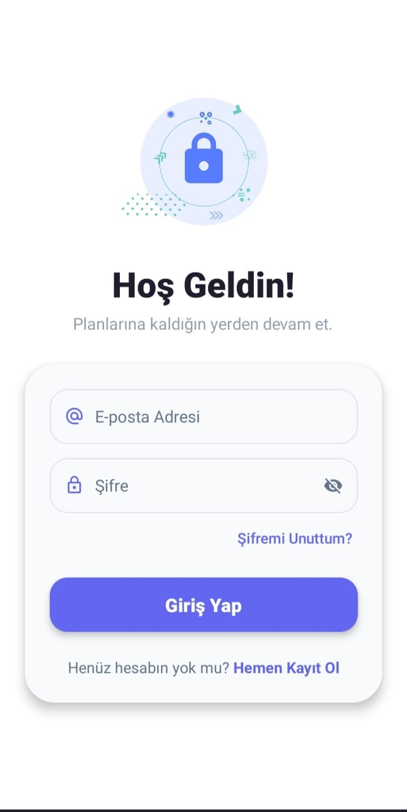 |
| **Marka Kimliği**<br>

<br>Marka renkleriyle (Mor-Mavi) tasarlanmış, şık ve hızlı açılış ekranı. | **Hikaye Modu**<br>

<br>Lottie animasyonları ile desteklenen, uygulamanın temel özelliklerini (Planla, Öğren, Takip Et) anlatan 3 adımlı tur. | **Güvenli Kapı**<br>

<br>Animasyonlu form geçişleri ve hata denetimi ile güvenli Firebase girişi. "Şifremi Unuttum" desteği. |

| ** Kayıt (Register)** |
| --- | 
| 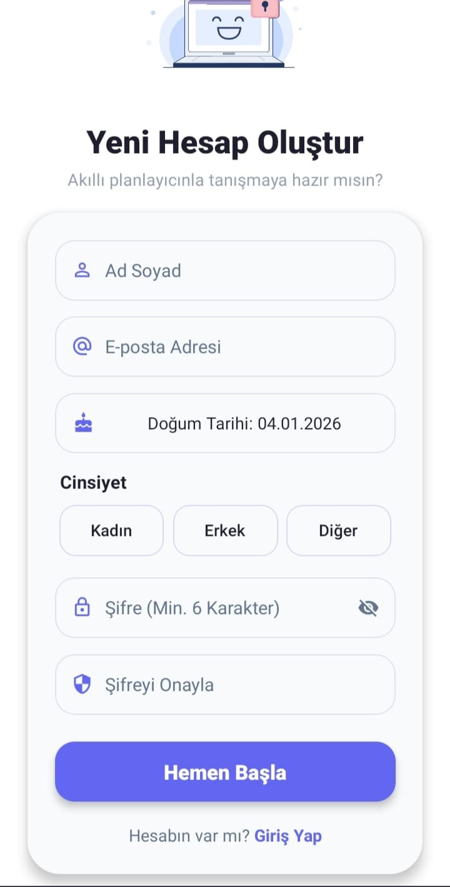 | 
| **Hızlı Hesap**<br>

<br>E-posta, isim ve şifre ile saniyeler içinde yeni hesap oluşturma. | **Kişiselleştirme**<br>

<br>Kullanıcının cinsiyetine göre avatar belirlemek ve doğum günü sürprizleri için veri girişi. |

---

### 🏠 Ana Merkez ve Planlama (Dashboard & Planner)

Kullanıcının gününü yönettiği ve motive olduğu komuta merkezi.

| ** Ana Sayfa (Home)** | ** Görevler (Tasks)** |
| --- | --- |
| 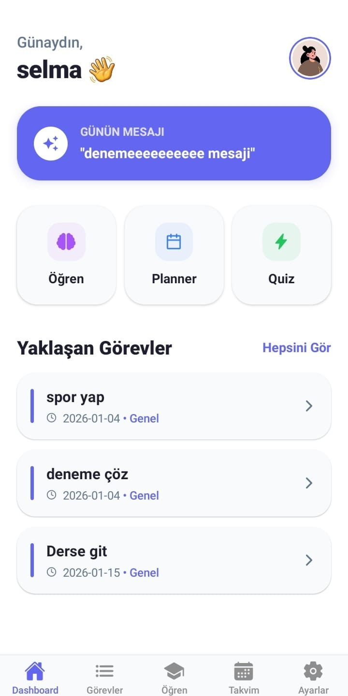 | 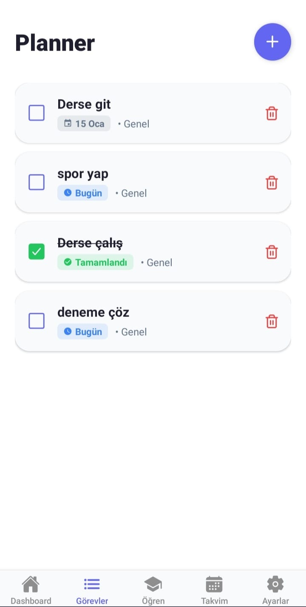 | 
| **Komuta Merkezi**<br>

<br>Günlük AI motivasyon mesajı, dinamik selamlama ve yaklaşan işlerin özeti. | **Akıllı Liste**<br>

<br>Tamamlanan işlerin üzerinin çizilmesi, geciken işlerin kırmızı uyarı vermesi. | **Hızlı Giriş**<br>

<br>Tarih seçici ve kategori belirleme ile saniyeler içinde yeni görev oluşturma modalı. |

| ** Takvim (Calendar)** | ** Görev Ekleme** |
| --- | --- |
| 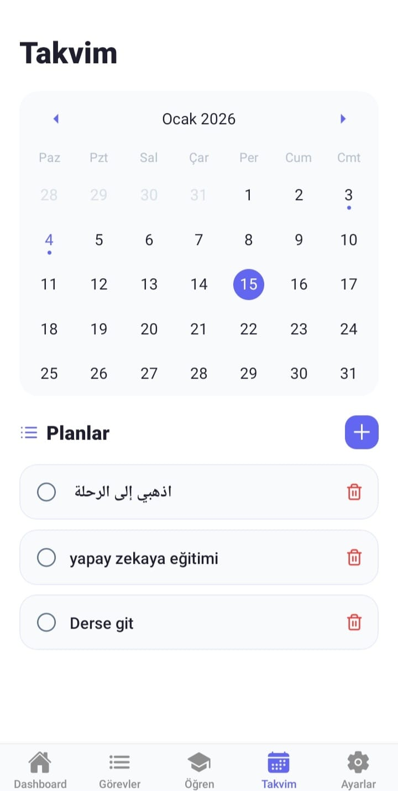 |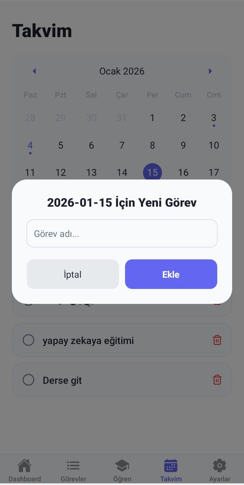 |
| **Geniş Perspektif**<br>|

<br>Aylık görünüm. Hangi günlerin dolu olduğunu gösteren nokta işaretçileri ve gün detayına inme imkanı. |

---

### 🧠 Öğrenme ve Gelişim (Learning Hub)

LifeMind'ı rakiplerinden ayıran "İkinci Beyin" modülü.

| ** Öğrenme Merkezi** | ** kelime ekle** | ** Quiz Modu** |--|
| --- | --- | --- |--|
|  | 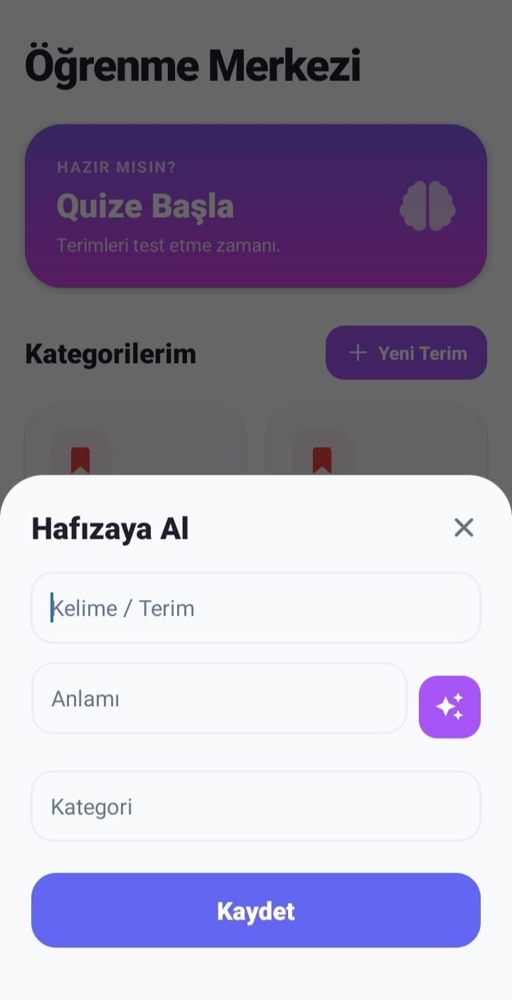 | 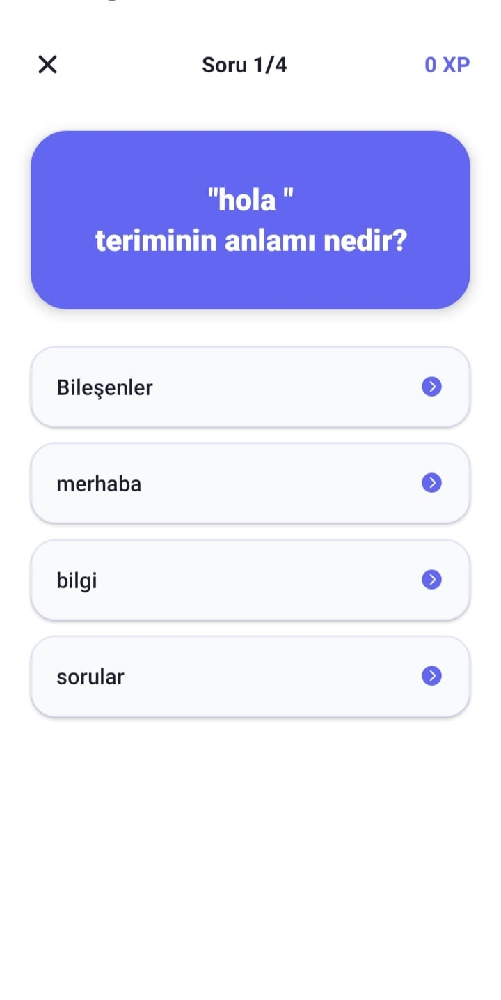 |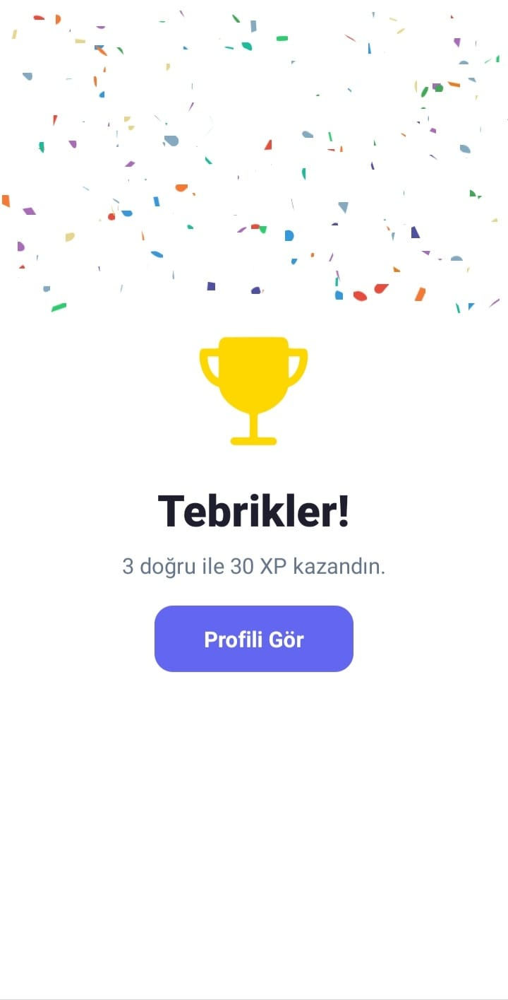|
| **Kategoriler**<br>

<br>Derslere veya konulara göre ayrılmış, ilerleme çubuklu kategori kartları. | **Aktif Öğrenme**<br>

<br>Ön yüzde terim, arka yüzde AI destekli tanım. Sesli okuma (TTS) özelliği. | **Gamification**<br>

<br>Otomatik üretilen sorular, AI ipuçları ve konfetili başarı ekranı. |

---

### ⚙️ Profil ve Ayarlar

| ** Profil & İstatistik** |karanlık modu|
| --- | --- |
| 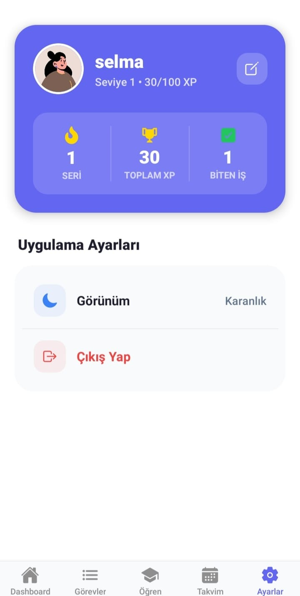 | 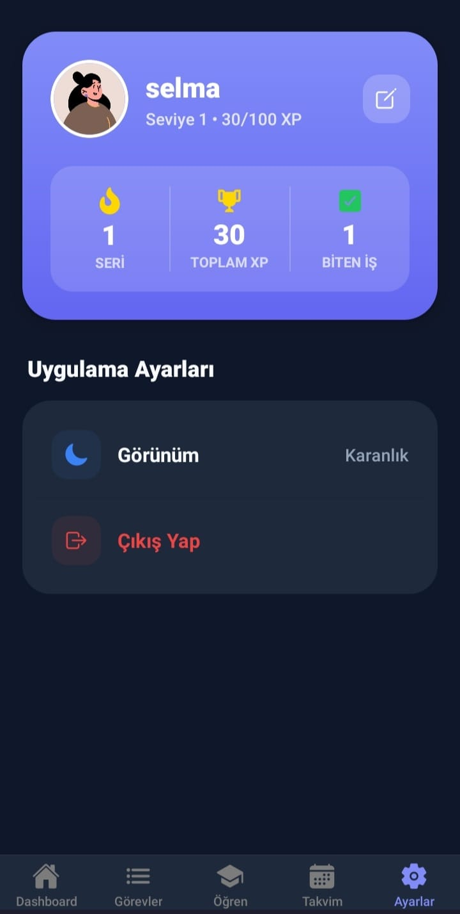 |
| **Gelişim Raporu**<br>


<br>Toplam XP, Günlük Seri (Streak) takibi, Tema değiştirme (Dark/Light) ve Profil düzenleme paneli. |


---

## 🛠 Teknik Altyapı (Tech Stack)

Bu proje, **Modern React Native** geliştirme standartlarına uygun olarak, **TypeScript** ve **Expo** ekosistemi üzerine inşa edilmiştir.

### Çekirdek Teknolojiler
* **React Native (Expo SDK 50+):** Ana geliştirme platformu.
* **TypeScript:** Tip güvenliği ve ölçeklenebilir kod yapısı için.
* **Expo Router (v3):** Dosya tabanlı (File-based) yönlendirme sistemi (`app/` dizini).

### Backend & Veri
* **Firebase Authentication:** Güvenli kullanıcı kimlik doğrulama.
* **Firebase Firestore:** NoSQL tabanlı, gerçek zamanlı veri saklama (Kullanıcılar, Görevler, Kartlar).
* **AsyncStorage:** Yerel veri saklama (Tema tercihi, Onboarding durumu, Mesaj önbelleği).

### Yapay Zeka (AI)
* **Google Gemini API:** `gemini-2.5-flash` modeli ile metin üretimi, tanımlamalar ve öneriler.

### UI & UX Kütüphaneleri
* **Lottie React Native:** Yüksek kaliteli vektörel animasyonlar.
* **Expo Linear Gradient:** Modern renk geçişleri.
* **React Native Calendars:** Özelleştirilebilir takvim bileşeni.
* **Expo Speech:** Metin okuma (Text-to-Speech) özelliği.
* **React Native Confetti Cannon:** Başarı kutlamaları için.
* **Date-fns:** Tarih formatlama ve lokalizasyon (TR).

---

## 📂 Proje Dosya Mimarisi

Proje, sürdürülebilirlik ve modülerlik ("Separation of Concerns") prensibine göre yapılandırılmıştır.

```bash
LIFEMIND/
├── app/                        # 📱 EKRANLAR VE ROTALAR (Expo Router)
│   ├── (tabs)/                 # Alt navigasyon barı (Bottom Tab)
│   │   ├── index.tsx           # Ana Sayfa (Dashboard)
│   │   ├── tasks.tsx           # Görev Listesi
│   │   ├── calendar.tsx        # Takvim
│   │   ├── learning.tsx        # Öğrenme Merkezi
│   │   ├── settings.tsx        # Profil ve Ayarlar
│   │   └── _layout.tsx         # Tab Bar konfigürasyonu
│   ├── auth/                   # Kimlik Doğrulama Grubu
│   │   ├── login.tsx           # Giriş Ekranı
│   │   └── register.tsx        # Kayıt Ekranı
│   ├── onboarding.tsx          # Karşılama Ekranı
│   ├── quiz.tsx                # Quiz Ekranı
│   ├── flashcard.tsx           # Kart Detay Ekranı
│   └── _layout.tsx             # Ana Navigasyon & ThemeContext Provider
├── assets/                     # 🎨 MEDYA DOSYALARI
│   ├── animations/             # Lottie JSON dosyaları (brain.json, clock.json vb.)
│   ├── images/                 # PNG/JPG görseller
│   └── fonts/                  # Özel fontlar
├── services/                   # ⚙️ İŞ MANTIĞI VE SERVİSLER
│   ├── aiService.ts            # Gemini API entegrasyonu
│   ├── taskService.ts          # Firestore Görev CRUD işlemleri
│   ├── learningService.ts      # Flashcard ve Kategori işlemleri
│   └── quizService.ts          # Quiz algoritması ve Puanlama
├── firebaseConfig.ts           # 🔥 Firebase Bağlantı Ayarları
├── app.json                    # ⚙️ Expo Konfigürasyonu (Splash, Icon, Scheme)
├── tsconfig.json               # TypeScript Ayarları
└── package.json                # Proje Bağımlılıkları

```

---

## 💻 Kurulum ve Çalıştırma Rehberi

Projeyi kendi bilgisayarınızda çalıştırmak için aşağıdaki adımları sırasıyla takip edin.

### 1. Ön Hazırlıklar

* **Node.js** (LTS sürümü önerilir)
* **Git**
* **Expo Go** uygulaması (Telefonunuzda) veya **Android Studio / Xcode** (Simülatör için).

### 2. Projeyi Klonlayın

```bash
git clone [https://github.com/selamalabdo/lifemind.git](https://github.com/selamalabdo/lifemind.git)
cd lifemind

```

### 3. Bağımlılıkları Yükleyin

```bash
npm install
# veya
yarn install

```

### 4. Konfigürasyon Ayarları (Kritik Adım!)

Projenin çalışması için API anahtarlarınızı girmeniz gerekir.

**A. Firebase Ayarları:**
`firebaseConfig.ts` dosyasını açın ve Firebase Console'dan aldığınız web yapılandırma bilgilerini girin:

```typescript
const firebaseConfig = {
  apiKey: "SENIN_API_KEYIN",
  authDomain: "proje-id.firebaseapp.com",
  projectId: "proje-id",
  // ...diğer ayarlar
};

```

**B. Google AI Ayarları:**
`services/aiService.ts` dosyasını açın ve Google AI Studio API anahtarınızı girin:

```typescript
const API_KEY = "AIzaSy..."; 

```

### 5. Uygulamayı Başlatın

Aşağıdaki komutla geliştirme sunucusunu başlatın. Eğer ikon veya splash screen güncellemeleri yaptıysanız `-c` bayrağı ile önbelleği temizleyin:

```bash
npx expo start -c

```

Terminalde çıkan **QR Kodu**, telefonunuzdaki **Expo Go** uygulaması ile okutun.

---
<div align="center">

**LifeMind Team** tarafından ❤️ ve ☕ ile geliştirilmiştir.
*(React Native, Expo, Firebase, Gemini AI)*

</div>
